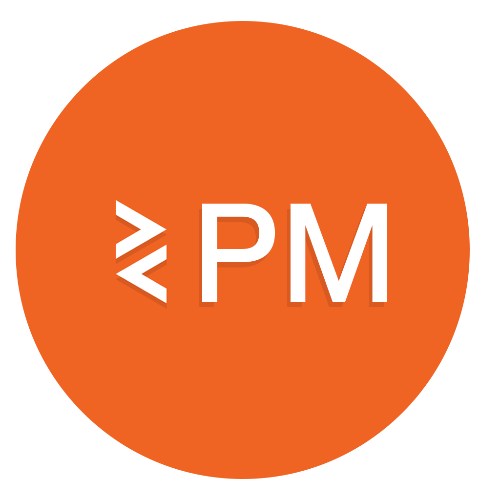
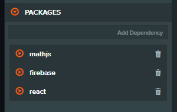

<div align="center">
  <br>
  
  <br>
  <h3 align="center">A Package Manager for PlayCanvas (beta)</h3>

</div>

<!-- <p align="center"> -->
<!--   <a href="#key-features">Key Features</a> • -->
<!--   <a href="#getting-started">Getting Started</a> • -->
<!--   <a href="#download">Download</a> • -->
<!--   <a href="#credits">Credits</a> • -->
<!--   <a href="#related">Related</a> • -->
<!--   <a href="#license">License</a> -->
<!-- </p> -->

<!--PCPM is an extension for the PlayCanvas Editor that adds support for Javascript Modules, TypeScript JSX and more. Your PlayCanvas scripts become JS modules which means you can import and export code.-->

_Warning! This extension is in beta and should not be used in production_

## Why?
When you're creating games in PlayCanvas you'll often find yourself wanting to import or share common code between files, or import some code from a 3rd party libray. Whilst there are a few ways to achieve this they often feel like a workaround. PCPM adds supports for js modules and allows you to import local code, install npm and use ~~TypeScript~~ and ~~JSX~~ in the code editor

```javascript

// JS Modules FTW!

import config from './config'
import { weirdLerp } from './utils/math'
import { firebaseApp } from 'firebase/app'

var MyScript = pc.createScript('myScript')

// initialize code called once per entity
MyScript.prototype.initialize = function() {

    // Import your own modules
    const value = weirdLerp(20, 0, 1)

    // Use NPM modules
    const app = firebaseApp(config)
}
```

## Getting Started

PCPM is a chrome extension that allows you as a Playcanvas developer, to use es modules and more in your projects.

The functionality provided is opt-in only. Even if you have the extension installed it will only run if a package.json file exists at the root of the asset registry for your project.

For a detailed walk through, [follow this guide](https://github.com/marklundin/pcpm/wiki/Getting-Started)

### Compiling the code

Once you have a package.json in the root or your registry your project scripts will be available to the pacakage manager. In order to build your code, [open the Code editor](https://developer.playcanvas.com/en/user-manual/scripting/code-editor/#opening-the-code-editor) for your project and create a new script or make a change to an existing script and then save it. Your code will then be compiled into a built file and if the script is added to a game entity, it will run in the PlayCanvas Launcher.

## Using the Package Manager

### Importing Local Scripts

PCPM upgrades your scripts to [js modules](https://developer.mozilla.org/en-US/docs/Web/JavaScript/Reference/Statements/import) which means you can export code from any script and imported into another

```javascript 
export const util
```
and import it into another
```javascript 
import { util } from './myutils'
``` 

### Import Packages


<br>

Using the PCPM Search in the code editor you can also find and install any publicy hosted npm pacakges. You can them import the package and use it like any other module

```javascript
import lodash from 'lodash'
import { firebaseApp } from 'firebase/app'

const MyScript =  pc.createScript('myScript')
```

### TypeScript
PCPM also proves experimental support for using TypeScript in your projects

### JSX
Experimental support for JSX is coming soon

### How does this all work?
PCPM contains a compiler that syncs with all scripts in your project and compiles them into a single file every time you save. Your asset registry is treated as a file system so local modules can be resolved aswell as remote modules which are loaded from a CDN. To do this, the extension marks all your scripts as 'excluded' which prevents them from being loaded in the launcher. This means any script attributes should resolve correctly as though you were working with the script directly

### Gotchas & Known Issues

#### My code isn't compiling / I can't see any changes
Make sure you have a valid json file named package.json at the root of the asset registry. PCPM only builds upon save, so make a change to update the build. If in doubt refresh the editor window. 

#### I can't use package XYZ
In theory, any package from [NPM](https://www.npmjs.com/) should work out of the box, but in practice some modules may have some limitations or strong dependancies on how they're used. If there's a specific module not working for you, report an issue.

#### I can't use a package with a wasm binary
All remote packages are loaded from a CDN which means any hardcoded references to local wasm binaries may fail. Instead see if you can instantiate the binaries by pointing to a remote hosted CDN

#### It always opens the built.js file when I hit edit in the editor
Because of the way PlayCanvas associates scripts with particular assets and because all scripts are compiled into a built version, the editor will always open the built.js for any given script

#### I can't install modules from github or from private accounts
The semantics of modules in package.json doesn't map exactly to how they're used in local projects. This means that scoped imports such as @org/somemodule or [urls modules](https://docs.npmjs.com/cli/v8/configuring-npm/package-json#urls-as-dependencies) do not work for now. If in doubt, use the package manager UI rather than manually editing the package.json file
